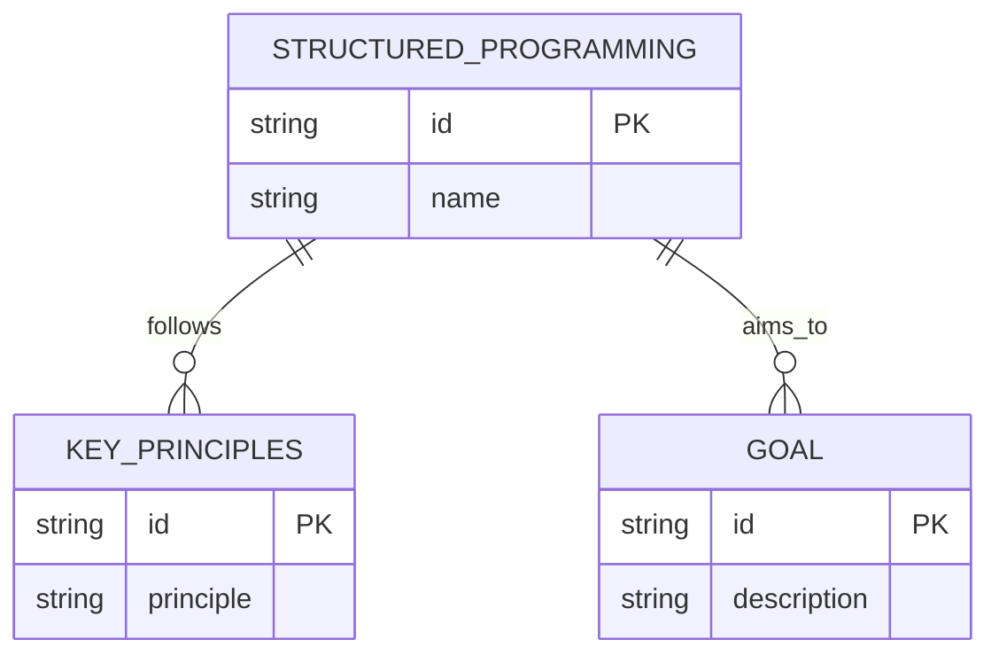
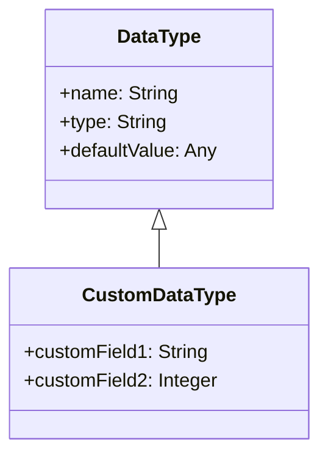
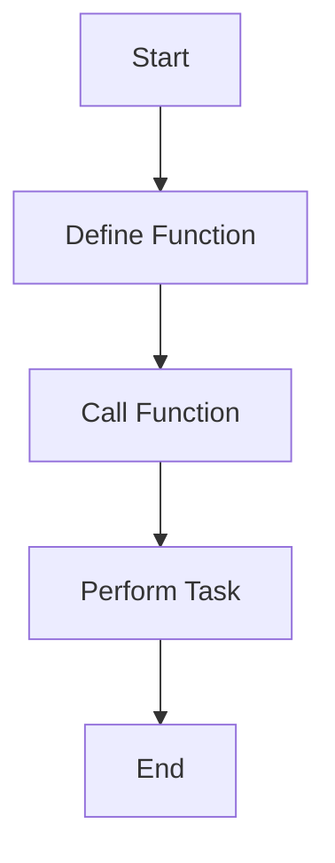
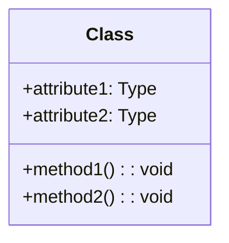
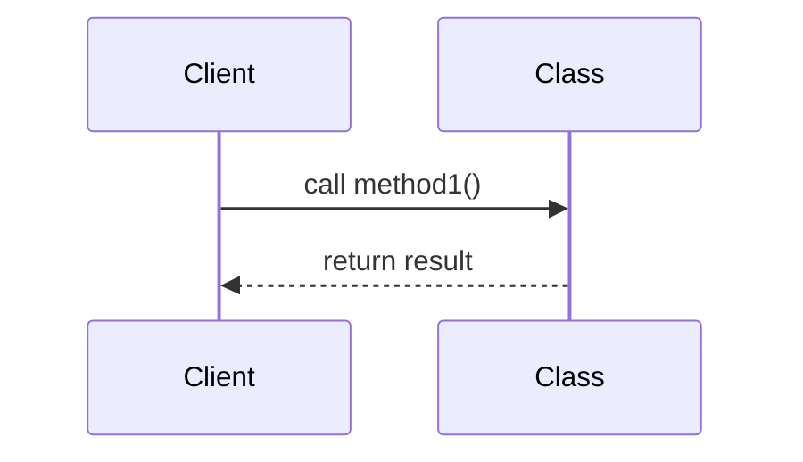
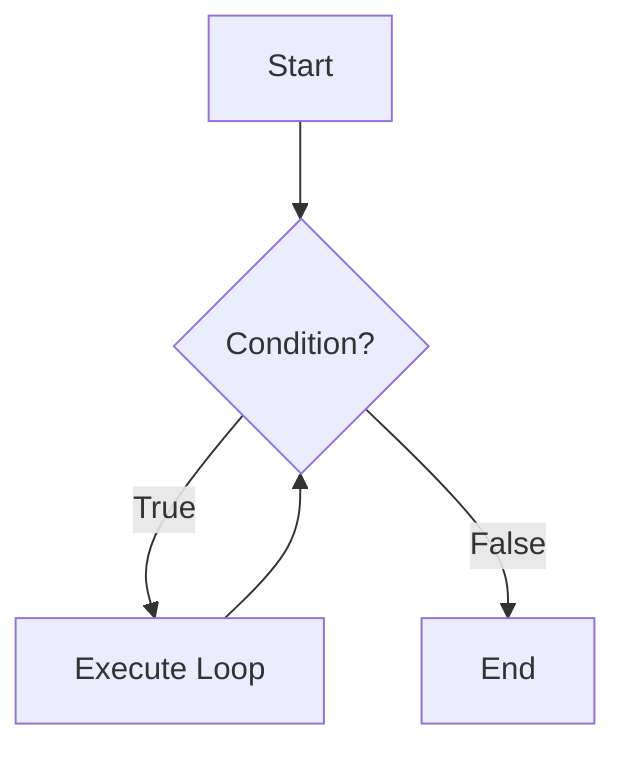
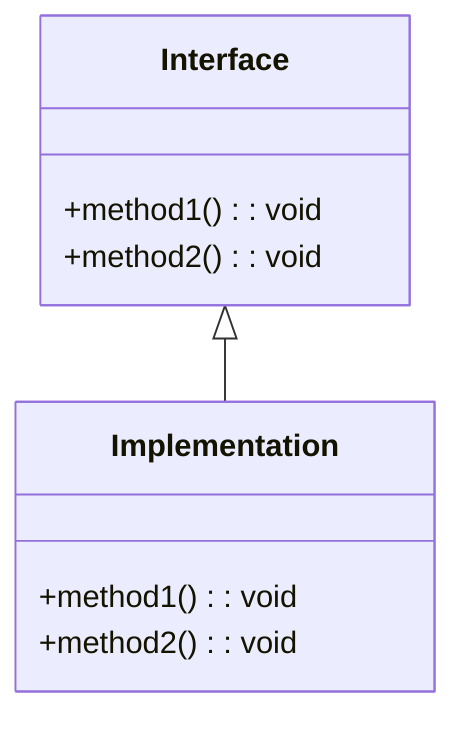
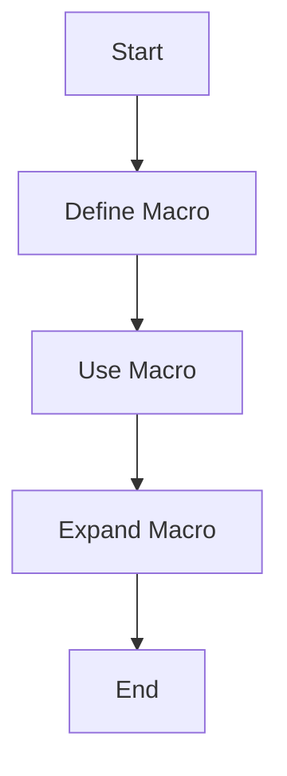

This workshop is focused on the fundamentals of network design and offers
applied application of learning through functional design considerations exploring protocols. 

# Introduction to Material and Design Considerations

In software engineering, various design methodologies are employed to create robust, maintainable, and reusable code. Here, we discuss three key design paradigms—**Structured Programming**, **Stratified Design**, and **Object-Oriented Design**—along with the elements you should aim to reuse in your code.

## Structured Programming
Structured Programming encourages the creation of modules that meet specific specifications and can be reused within the bounds of those specifications.  
- **Key principles**:  
  - Emphasizes clear, linear flow of control.  
  - Utilizes **subroutines**, **loops**, and **conditionals** to create well-defined program structures.  
- **Goal**: Simplify the development process and enhance code readability.

> **Note**: Use this approach for simpler systems with a focus on clear program logic.

---

## Stratified Design
Stratified Design builds on the principles of Structured Programming by encouraging the development of modules with commonly needed functionality.  
- **Key principles**:  
  - Promotes **modularity** and **separation of concerns**.  
  - Encourages modules that are adaptable to specification changes or reusable in different programs.  
- **Benefits**:  
  - Easier to adapt and extend software.  
  - Reduces duplication of effort.

> **Annotation**: Stratified Design is ideal for systems requiring flexibility and frequent updates.

---

## Object-Oriented Design
Object-Oriented Design (OOD) is a form of stratified design that focuses on **classes of objects** and **information hiding**.  
- **Key principles**:  
  - Encapsulation of data and behavior within objects.  
  - Reusability through inheritance and polymorphism.  
- **Benefits**:  
  - Enhances maintainability and modularity.  
  - Simplifies the creation and management of complex systems.  

> **Example**: Use OOD to design applications with interconnected components, such as a customer management system.

---

## Reusability Considerations
To maximize **reusability** in your code, aim to reuse the following elements:

### 1. **Data Types**
- Define and reuse **custom data types** to ensure consistency and reduce redundancy.

### 2. **Functions**
- Create reusable **functions** that perform specific tasks and can be called from different parts of the program.

### 3. **Classes**
- Design **classes** that encapsulate data and behavior, promoting reuse and modularity.

### 4. **Methods**
- Implement **methods** within classes that can be reused across different instances and contexts.

### 5. **Control Abstractions**
- Use control structures like **loops** and **conditionals** to create reusable patterns of execution.

### 6. **Interface Abstractions**
- Define clear **interfaces** for modules and classes to promote interoperability and reuse.

### 7. **Syntactic Abstractions**
- Utilize **macros** and other syntactic constructs to create reusable code snippets.

### 8. **Packages and Modules**
- Organize related functionality into **packages** and **modules** to promote reuse and maintainability.

### 9. **Whole Languages**
- In some cases, entire **domain-specific languages** can be created to facilitate reuse across different projects.

> **Tip**: Consistently applying these principles ensures long-term scalability and efficiency in software development.
