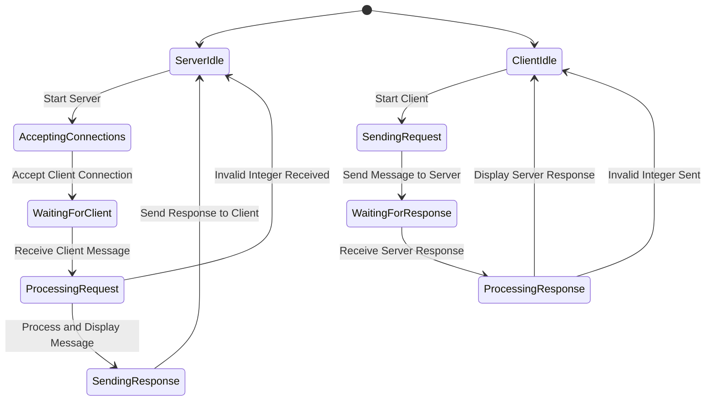

```mermaid
stateDiagram
    [*] --> ServerIdle
    [*] --> ClientIdle

    ServerIdle --> AcceptingConnections: Start Server
    AcceptingConnections --> WaitingForClient: Accept Client Connection
    WaitingForClient --> ProcessingRequest: Receive Client Message
    ProcessingRequest --> SendingResponse: Process and Display Message
    SendingResponse --> ServerIdle: Send Response to Client

    ClientIdle --> SendingRequest: Start Client
    SendingRequest --> WaitingForResponse: Send Message to Server
    WaitingForResponse --> ProcessingResponse: Receive Server Response
    ProcessingResponse --> ClientIdle: Display Server Response

    ProcessingRequest --> ServerIdle: Invalid Integer Received
    ProcessingResponse --> ClientIdle: Invalid Integer Sent
```