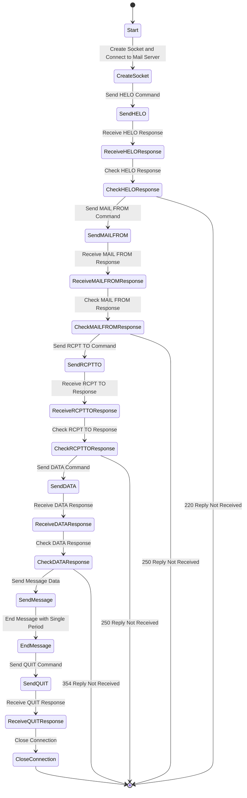

# lab

```mermaid
stateDiagram
    [*] --> Start
    Start --> CreateSocket: Create Socket and Connect to Mail Server
    CreateSocket --> SendHELO: Send HELO Command
    SendHELO --> ReceiveHELOResponse: Receive HELO Response
    ReceiveHELOResponse --> CheckHELOResponse: Check HELO Response
    CheckHELOResponse --> SendMAILFROM: Send MAIL FROM Command
    SendMAILFROM --> ReceiveMAILFROMResponse: Receive MAIL FROM Response
    ReceiveMAILFROMResponse --> CheckMAILFROMResponse: Check MAIL FROM Response
    CheckMAILFROMResponse --> SendRCPTTO: Send RCPT TO Command
    SendRCPTTO --> ReceiveRCPTTOResponse: Receive RCPT TO Response
    ReceiveRCPTTOResponse --> CheckRCPTTOResponse: Check RCPT TO Response
    CheckRCPTTOResponse --> SendDATA: Send DATA Command
    SendDATA --> ReceiveDATAResponse: Receive DATA Response
    ReceiveDATAResponse --> CheckDATAResponse: Check DATA Response
    CheckDATAResponse --> SendMessage: Send Message Data
    SendMessage --> EndMessage: End Message with Single Period
    EndMessage --> SendQUIT: Send QUIT Command
    SendQUIT --> ReceiveQUITResponse: Receive QUIT Response
    ReceiveQUITResponse --> CloseConnection: Close Connection
    CloseConnection --> [*]

    CheckHELOResponse --> [*]: 220 Reply Not Received
    CheckMAILFROMResponse --> [*]: 250 Reply Not Received
    CheckRCPTTOResponse --> [*]: 250 Reply Not Received
    CheckDATAResponse --> [*]: 354 Reply Not Received
```
