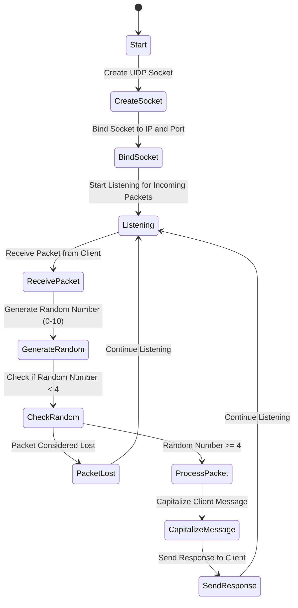
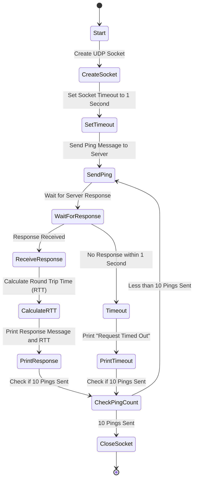
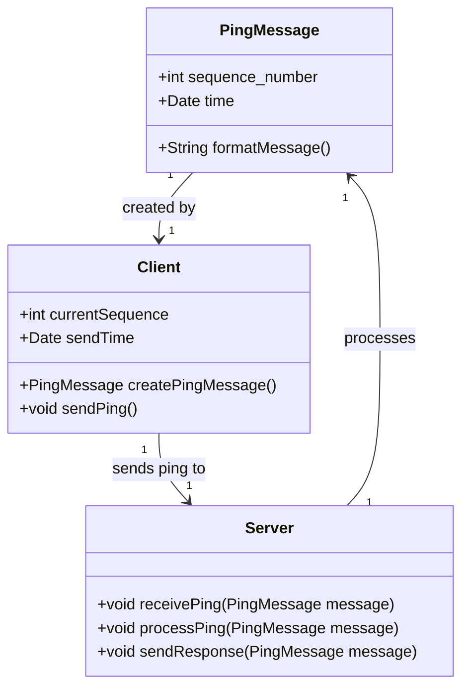

# UDP Ping lab

```mermaid
stateDiagram
    [*] --> Start
    Start --> CreateSocket: Create UDP Socket
    CreateSocket --> BindSocket: Bind Socket to IP and Port
    BindSocket --> Listening: Start Listening for Incoming Packets

    Listening --> ReceivePacket: Receive Packet from Client
    ReceivePacket --> GenerateRandom: Generate Random Number (0-10)
    GenerateRandom --> CheckRandom: Check if Random Number < 4

    CheckRandom --> PacketLost: Packet Considered Lost
    PacketLost --> Listening: Continue Listening

    CheckRandom --> ProcessPacket: Random Number >= 4
    ProcessPacket --> CapitalizeMessage: Capitalize Client Message
    CapitalizeMessage --> SendResponse: Send Response to Client
    SendResponse --> Listening: Continue Listening
```
# Client Code

```mermaid
stateDiagram
    [*] --> Start
    Start --> CreateSocket: Create UDP Socket
    CreateSocket --> SetTimeout: Set Socket Timeout to 1 Second
    SetTimeout --> SendPing: Send Ping Message to Server
    SendPing --> WaitForResponse: Wait for Server Response

    WaitForResponse --> ReceiveResponse: Response Received
    ReceiveResponse --> CalculateRTT: Calculate Round Trip Time (RTT)
    CalculateRTT --> PrintResponse: Print Response Message and RTT
    PrintResponse --> CheckPingCount: Check if 10 Pings Sent

    WaitForResponse --> Timeout: No Response within 1 Second
    Timeout --> PrintTimeout: Print "Request Timed Out"
    PrintTimeout --> CheckPingCount: Check if 10 Pings Sent

    CheckPingCount --> SendPing: Less than 10 Pings Sent
    CheckPingCount --> CloseSocket: 10 Pings Sent
    CloseSocket --> [*]
```
Requirements

```mermaid
classDiagram
    class PingMessage {
        +int sequence_number
        +Date time
        +String formatMessage()
    }

    class Client {
        +int currentSequence
        +Date sendTime
        +PingMessage createPingMessage()
        +void sendPing()
    }

    class Server {
        +void receivePing(PingMessage message)
        +void processPing(PingMessage message)
        +void sendResponse(PingMessage message)
    }

    PingMessage "1" --> "1" Client : created by
    Client "1" --> "1" Server : sends ping to
    Server "1" --> "1" PingMessage : processes
```