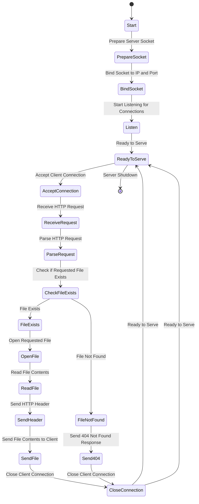

# Web Server

```mermaid
stateDiagram
    [*] --> Start
    Start --> PrepareSocket: Prepare Server Socket
    PrepareSocket --> BindSocket: Bind Socket to IP and Port
    BindSocket --> Listen: Start Listening for Connections

    Listen --> ReadyToServe: Ready to Serve
    ReadyToServe --> AcceptConnection: Accept Client Connection
    AcceptConnection --> ReceiveRequest: Receive HTTP Request

    ReceiveRequest --> ParseRequest: Parse HTTP Request
    ParseRequest --> CheckFileExists: Check if Requested File Exists

    CheckFileExists --> FileExists: File Exists
    FileExists --> OpenFile: Open Requested File
    OpenFile --> ReadFile: Read File Contents
    ReadFile --> SendHeader: Send HTTP Header
    SendHeader --> SendFile: Send File Contents to Client
    SendFile --> CloseConnection: Close Client Connection
    CloseConnection --> ReadyToServe: Ready to Serve

    CheckFileExists --> FileNotFound: File Not Found
    FileNotFound --> Send404: Send 404 Not Found Response
    Send404 --> CloseConnection: Close Client Connection
    CloseConnection --> ReadyToServe: Ready to Serve

    ReadyToServe --> [*]: Server Shutdown
```
